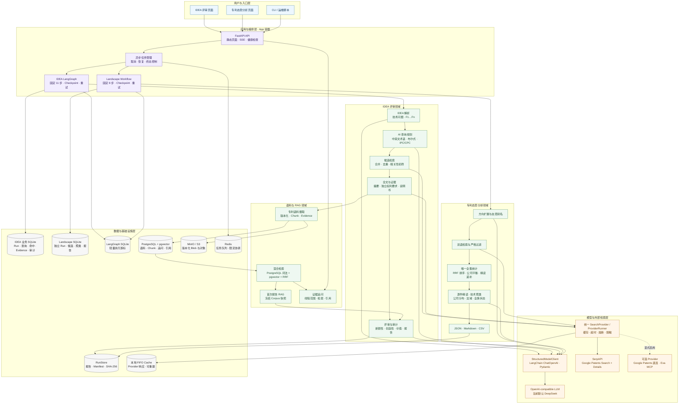
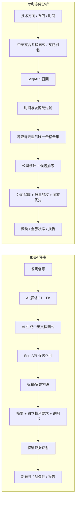

# AIFPatent 当前系统架构图

> 更新日期：2026-07-23  
> 范围：当前 `develop` 分支已经实现的 IDEA 评审、专利态势分析、首次报告 RAG、证据追问和容器部署。

## 总体架构

## 两条核心业务数据流

## 关键边界

- 大模型负责受 Schema 约束的理解与语义分析，不负责自由改变工作流、绕过证据门或直接操作存储。
- SerpAPI 是当前默认外部专利搜索与详情源；Google Patents 直连和 Exa 保留为显式启用的补充源。
- IDEA 候选召回是 Google Patents 全文关键词检索，本地初筛使用标题与搜索摘要，入选后才核验独立权利要求和说明书。
- 专利态势的公司柱状图使用严格过滤并跨查询去重后的全部唯一合格专利；技术聚类只覆盖成功精读集合。
- SQLite 保存运行与审计事实，PostgreSQL/pgvector 和 MinIO 保存耐久语料与 RAG 数据，LangGraph SQLite 只保存轻量执行状态。
- API Key 不进入 Git、业务数据库、Graph State、报告或浏览器持久存储。
