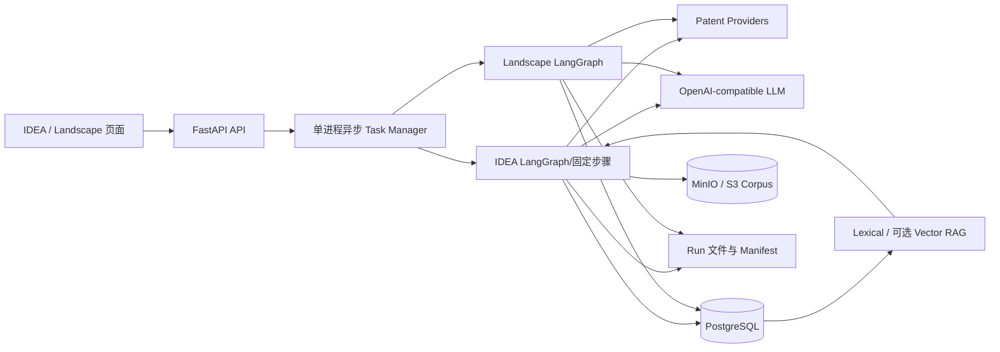

# AIFPatent 当前代码全景讲解（初稿）

> 代码基线：`feature/agent-upgrade`，HEAD `722a810`，2026-07-29
> 取证口径：本文件只读取当前 Python、SQL、配置、容器、Shell、前端和测试代码，不采用 README、development 文档或旧架构图作为事实来源。
> 定位：这是一份串讲底稿，同时区分“当前已经接通的能力”“Schema/适配器已经预留的能力”和“代码中仍存在的断点”。

## 1. 一句话理解项目

AIFPatent 是一个**证据约束型专利研发工作台**。它有两条主业务：

1. **IDEA 专利评估**：把用户技术方案拆成必要特征，检索并精读现有专利，给出新颖性、创造性和申请价值的初步判断。
2. **专利态势分析**：在一个不超过 12 个月的时间窗内，按技术方向、竞争对手或两者组合检索完整候选集，形成公司技术分类和跨公司趋势。

首次 IDEA 报告完成后还有一条辅助能力：

- **证据追问**：在用户冻结的报告专利范围内，每一轮重新检索原文并回答重合、技术解释和规避设计问题。

项目的核心不是“让大模型自由搜索并写报告”，而是：

> 程序冻结范围、组织数据、控制身份、计算分数并校验证据；大模型只在被允许的事实包内完成语义理解和结构化表达。

## 2. 总体架构

### 2.1 运行时组件

默认 Docker 运行时只有三个服务：

| 组件 | 当前职责 |
|:---|:---|
| FastAPI 应用 | 同时承载 IDEA、追问、Landscape API，托管两个静态前端，并在单进程内创建异步任务。 |
| PostgreSQL 17 + pgvector | 保存两条业务线的 Run/Step、检索、文献、证据、结论、追问、语料元数据、Landscape 公司趋势以及缓存元数据。 |
| MinIO/S3 | 按内容哈希保存不可变专利规范化正文 Blob。 |
| 本地持久卷 | 保存每个 Run 的输入快照、JSON/Markdown/CSV 报告、Manifest、可重建缓存和日志。 |
| 外部大模型 | 通过用户每次 Run 提交的 Base URL、Model、API Key 调用 OpenAI-compatible Chat API。 |
| 外部专利 Provider | 默认只有 SerpAPI Google Patents 开启；Exa 与直接 Google Patents 代码存在但配置关闭。 |

生产 Runtime 由 `backend/idea/runtime.py` 和 `backend/landscape/runtime.py` 创建。二者都强制要求 `AIFPATENT_POSTGRES_DSN`；SQLite 类仍在仓库中，但当前 app 构建不会把它作为生产事实源。Redis Queue/Limiter 适配器也仍保留，但默认 Compose 没有 Redis 服务，当前任务管理器不使用它们。

### 2.2 分层结构



可将代码分为六层：

1. **产品入口**：`frontend/`、`backend/main.py`、各 API Router。
2. **流程控制**：IDEA、追问和 Landscape 三个固定 Workflow。
3. **领域服务**：检索、文献分析、新颖性、创造性、公司分类、趋势、审计。
4. **模型边界**：`StructuredModelClient`、每个 Agent 的 Prompt、Pydantic 输出 Schema。
5. **持久化边界**：PostgreSQL Repository、Corpus/S3、Run Store、Cache。
6. **运维边界**：配置校验、迁移、健康检查、非 root 容器、日志去敏。

## 3. 最重要的设计原则：模型与程序各负责什么

### 3.1 大模型负责的“智能”

模型适合处理难以用规则穷举的语义任务：

- 从 IDEA 原文识别技术领域、问题、效果和必要技术特征。
- 发现中英文同义词、上位词和分类号候选。
- 判断一段专利证据对某个技术特征是完全披露、部分披露、未披露还是不确定。
- 在给定 D1/D2 证据内分析组合动机和创造性。
- 给申请价值维度评分并生成中文理由。
- 对已冻结事实进行语义审计和报告叙述。
- 为 Landscape 扩展技术词与竞争对手别名。
- 在单家公司范围内按技术方案分类。
- 在多个公司 Profile 与证据范围内归纳跨公司趋势。
- 规划和生成证据追问答案。

### 3.2 程序掌握的“控制权”

这些事情不交给模型：

- Run、Document、Version、Chunk、Evidence、Category、Trend 的真实 ID。
- 时间窗、评估日、专利公开号规范化和范围过滤。
- 候选合并、公司唯一归属、完整集合覆盖和重复检测。
- 检索分数、RRF、候选选样、新颖性最终结论。
- Evidence 是否属于正确的 Run、文献、Chunk 和 Publication。
- Hash 是否匹配，Citation 是否确实来自本轮 Context。
- Step 顺序、Attempt、Timeout、状态转换和完成门槛。
- API Key 是否持久化。
- 报告文件是否完整、是否可通过 Manifest 重验。

这形成一个稳定模式：

```text
程序构造冻结输入
  → 模型返回严格 JSON
  → Pydantic 校验结构
  → 领域校验身份/集合/证据
  → 失败时有限纠错或重试
  → 程序持久化规范结果
```

## 4. 功能一：IDEA 专利评估

### 4.1 用户实际操作

页面 `/` 的实际使用过程是：

1. 创建或选择 Case。
2. 输入不少于 10 字、最多 200,000 字的技术方案，可选择已上传附件。
3. 设置评估日、检索模式 `quick/standard/deep`，填写模型 Base URL、Model 和 API Key。
4. 创建 Run。输入会立刻形成不可变快照；模型凭证只进入该进程的内存。
5. 页面通过 SSE 观察 11 个步骤。
6. 完成后查看 JSON 化报告，或下载 Markdown 和其他 Artifact。
7. 在报告专利中选择冻结范围，建立追问 Thread 并连续提问。

### 4.2 11 步主流程

`backend/idea/workflow.py` 定义严格顺序：

| 步骤 | 输入到输出 | 模型位置 | 程序门槛 |
|:---|:---|:---|:---|
| `PREPARE_INPUT` | 原文、附件 → 输入快照 | 无 | 原子写入；记录大小和 SHA-256。 |
| `PARSE_IDEA` | 原文 → IDEA 结构、F1..Fn | IDEA Parser | 不允许搜索、引专利或补造实现；保留原文与偏移。 |
| `VALIDATE_IDEA_MODEL` | 解析结果 → 冻结特征 | 无 | 必要特征唯一、顺序稳定、来源可追溯。 |
| `PLAN_QUERIES` | IDEA → 术语组与检索式 | Query Planner | 8–16 个中英文草案；程序再拆成最多 24 个宽召回式。 |
| `RETRIEVE_CANDIDATES` | Query×Provider → 合并候选 | 无 | 轮次、预算、Provider 熔断、饱和停止、日期筛选。 |
| `NORMALIZE_AND_FETCH` | 候选 → 可用全文、Corpus Version | 无 | 公开号规范化；多 Provider 回退；必须有摘要和可识别独立权利要求；候补补位。 |
| `ANALYZE_DOCUMENTS` | Feature×Version Context → 每篇特征矩阵 | Document Analyzer | 每个必要特征恰好一次；正向披露必须有本篇 Citation；负向判断不得带 Citation。 |
| `DETERMINE_NOVELTY` | 全部文献矩阵 → 新颖性 | 无 | 程序确定性计算，禁止跨文献拼接破坏新颖性。 |
| `ANALYZE_INVENTIVENESS` | D1 区别特征 + D2 证据 → 最多 3 条路线 | Inventive Analyzer | D2 必须来自已深读的其他文献；每个公开号必须绑定自己的 Evidence。 |
| `ASSESS_VALUE` | IDEA + 冻结结论 → 价值评价 | Value Analyzer | 只可引用允许的逻辑 Basis ID；不能改变新颖性/创造性。 |
| `AUDIT_AND_REPORT` | 全部持久事实 → 审计、报告 | Evidence Auditor、Report Composer | 确定性审计优先；Critical 阻断完成；Narrative 不能新增专利、日期、数量或结论。 |

每步输入输出都会规范化为 JSON 并计算哈希。Step 只有上一项成功后才能开始；默认单步 600 秒、最多 3 次 Attempt。

## 5. IDEA 的外部专利检索逻辑

### 5.1 查询为什么不是直接执行模型输出

Query Planner Prompt 要求：

- 生成 8–16 个中英文查询。
- 一个查询只覆盖一个或两个概念组，禁止三个以上概念用 AND 强交。
- 技术手段、问题、效果和区别特征分开检索。
- IPC/CPC 单独检索。
- 不得输出占位符、搜索结果或结论。

模型输出之后，`expand_recall_plan()` 仍会做程序化重写：

1. 删除 `IPC:`、`CPC:` 等 Provider 不通用字段前缀。
2. 将过度约束的 AND 查询拆成最多两个概念一组。
3. 再加入单概念的中英文 OR 兜底。
4. IPC/CPC 候选单独执行，不与多个技术概念强交。
5. 最终最多 24 个可执行 Query。
6. Exa 若启用，会去掉布尔运算符，转成语义查询文本。

这个设计的出发点是：**模型擅长发现词，不擅长稳定控制每个 Provider 的查询方言。**

### 5.2 Query×Provider 执行

- Query 按 `round_number` 分轮。
- 同一轮生成全部 Query×Provider 调用。
- 不同 Provider 可以并行；同一个 Provider 在一个 Run 内由 `Semaphore(1)` 串行，避免瞬时打爆限额。
- SerpAPI 遇到缺 Key、鉴权失败、Forbidden 或 Rate Limit，会在本 Run 内熔断剩余调用。
- Exa 遇到 429 同样熔断。
- 每次调用的状态、耗时、数量和错误写入 `tool_calls`；命中写入 `search_hits`。

### 5.3 候选合并与停止

不同 Query/Provider 的命中通过规范化公开号、申请号和同族标识合并为 `MergedHit`。每轮重新计算：

- `total_candidates`
- `new_families`
- `new_high_relevance_families`
- `successful_providers`

停止原因有四种：

- `CANDIDATE_MAX`：达到候选上限。
- `PROVIDERS_UNAVAILABLE`：本轮没有成功 Provider。
- `SATURATED`：连续配置轮数新增高相关同族不超过阈值。
- `QUERY_EXHAUSTED`：计划查询全部跑完。

默认饱和规则是连续 2 轮、每轮新增高相关同族不超过 1。

### 5.4 标题摘要相关性评分

检索第一阶段只用题名和摘要/片段做低成本筛选。

有术语组时：

```text
relevance
  = 0.70 × 命中的概念组比例
  + min(0.20, 命中术语数 × 0.05)
  + min(0.10, 题名命中术语数 × 0.05)
```

无术语组时：

```text
relevance
  = 0.75 × 命中术语覆盖率
  + min(0.25, 题名命中术语数 × 0.08)
```

分数上限为 1，当前深读强相关阈值为 `0.15`。公开日晚于评估日的候选被排除；公开日未知可以继续进入全文核验，但在最终新颖性门槛前必须有合法日期。

### 5.5 三档预算

当前 `config/ai4patent.json`：

| 模式 | 最大候选 | 深读下限 | 深读上限 |
|:---|---:|---:|---:|
| quick | 60 | 10 | 10 |
| standard | 200 | 10 | 20 |
| deep | 400 | 20 | 40 |

程序还根据技术领域数、特征数和搜索词具体程度推导 Narrow/Medium/Broad：

- Narrow 的深读目标取下限。
- Medium 取上下限中点。
- Broad 取上限。

若强相关候选少于下限，程序会补入低置信候选做全文核验，并显式记录 `LOW_CONFIDENCE_RECALL_BACKFILL`。这不是把弱摘要当证据，而是给全文一次证明自己的机会。

## 6. 全文抓取、Corpus 和首次报告 RAG

### 6.1 全文抓取的合格条件

抓取按 Provider 优先级尝试：

1. SerpAPI Google Patents
2. 直接 Google Patents
3. Exa

当前配置只有第一项启用。并发默认 3。一个全文要进入深读，至少需要：

- 可规范化的公开号。
- 合法评估日范围。
- 非空摘要。
- 可识别的独立权利要求证据。

首选文献抓取失败或证据不完整时，从同轮保留候选中补位。若最终全文数低于深读下限，后续结论必须降级或记录限制。

### 6.2 为什么要有不可变 Corpus Version

`patent_documents` 表保存可更新的业务文献视图；真正用于 RAG 重放的是：

```text
patent_document
  → patent_document_version
  → corpus_blob（MinIO，按 SHA-256 寻址）
  → patent_chunk
  → run_document_version（冻结到某个 Run）
```

同一文献内容发生变化时新增 Version，不覆盖旧 Version。S3 对象键如果已经存在但哈希不同会直接报错；读取时也重新核验 SHA-256。

### 6.3 分块

当前 `claims-paragraphs-v2` 的主要规则：

- Abstract 独立成块。
- Claim 按权利要求拆分，记录 `claim_number`、独立/从属类型和父权利要求链。
- Description 按段落切块。
- 每块保存正文哈希、原文偏移、Token 数和 Chunker Version。

### 6.4 Feature×Version 检索矩阵

首次报告不是“对所有全文搜一次”，而是对每个必要特征与每个冻结文献版本生成一对检索：

```text
{F1..Fn} × {V1..Vm}
```

矩阵必须完整，否则流程失败。每对默认取 8 个检索片段；无论相关性排序如何，程序额外强制加入：

- 该 Version 的摘要。
- 所有独立权利要求。
- 命中从属权利要求的完整父权利要求链。

如果输入预算连这些强制证据都容不下，程序拒绝生成该文献 Context。

### 6.5 关键词、向量和 RRF

默认 Embedding 配置为关闭，因此当前实际模式是 `LEXICAL_ONLY`。

关键词检索由 PostgreSQL 完成：

```text
lexical_score
  = ts_rank_cd(simple FTS)
  + word_similarity(pg_trgm)
```

排序优先精确子串，其次综合分数，再用 `chunk_id` 稳定打破平局。查询被严格限制在 `allowed_version_ids`。

开启 Embedding 后：

```text
rrf_score
  = [若有 lexical_rank] 1 / (60 + lexical_rank)
  + [若有 vector_rank]  1 / (60 + vector_rank)

final_score = rrf_score × section_weight
```

Claim Overlap / Novelty 会提高独立权利要求权重至 `1.30`；技术解释提高说明书权重至 `1.25`；规避设计对权利要求和说明书都给予较高权重。

最终默认最多 12 个 Chunk，同一 Version 最多 4 个，同一 Section Label 最多 2 个，并按 `text_hash` 去重。

### 6.6 Context 与 Citation

Context Assembler 给选中片段分配 `C1..Cn`，同时保存：

- Run、Turn、用途。
- Corpus Snapshot Hash。
- 允许的 Version IDs。
- 选中 Chunk IDs。
- Citation Alias 绑定。
- Token 预算、遗漏和限制。
- Prompt/Retriever/Token Counter Version。
- 完整 Context Hash。

模型只能引用 `C1..Cn`。随后程序把别名还原成 Publication、Section、Quote、Offset 和 Text Hash，形成可验证 Citation。

## 7. IDEA 文献映射、新颖性、创造性和价值评分

### 7.1 单篇文献的特征矩阵

Document Analyzer 对每篇专利独立工作，必须为每个必要特征返回一次：

| 状态 | 含义 | Citation 规则 |
|:---|:---|:---|
| `DISCLOSED` | 证据完整披露该特征 | 至少一个本篇 Citation |
| `PARTIAL` | 只披露部分技术要素 | 至少一个本篇 Citation |
| `NOT_DISCLOSED` | 在允许证据内未发现披露 | 不得引用 Citation |
| `UNCERTAIN` | 证据不足以确认 | 不得引用 Citation |

程序检查特征集合是否精确、公开号是否一致、Evidence 是否属于本篇、哈希是否一致。模型不允许在这一步作整体新颖性判断，也不能跨文献组合。

### 7.2 新颖性是程序算的

用于寻找“最接近文献”的内部权重：

```text
DISCLOSED      = 1.00
PARTIAL        = 0.50
UNCERTAIN      = 0.25
NOT_DISCLOSED  = 0.00

document_score = 所有必要特征权重的平均值
document_confidence = 所有映射置信度的最小值
```

结论规则：

1. 任何一篇、且只能是一篇文献自身将所有必要特征标为 `DISCLOSED`，结论为 `NOT_NOVEL`。
2. 没有破坏性文献，而且每篇文献至少有一个明确 `NOT_DISCLOSED`，同时深读数达到下限，结论为 `NOVEL`。
3. 否则为 `UNCERTAIN`。

`NOVEL` 或 `UNCERTAIN` 的总置信度是各篇最低映射置信度的平均值，上限 `0.95`；`NOT_NOVEL` 取破坏性文献的最低映射置信度。

这里没有把多篇文献拼起来否定新颖性，符合项目自己的单篇披露规则。

### 7.3 创造性路线

若新颖性已经是 `NOT_NOVEL`，创造性路线为空。否则：

1. 先按 D1 已披露特征数、总置信度和公开号排序。
2. 优先使用 `closest_publication_number`。
3. 最多建立 3 条 D1 路线。
4. D1 中非 `DISCLOSED` 的特征成为区别特征。
5. 每个区别特征最多取 5 个 D2 候选。
6. D2 必须来自同一 Run 中另一篇已深读文献，状态只能是 `DISCLOSED/PARTIAL`，并携带自己的 Evidence。

模型应用 Problem-Solution Approach，判断客观技术问题、D2 教导和组合动机。要输出 `NOT_INVENTIVE`，每个区别特征都必须：

- 至少有一个 D2 Publication。
- 至少有一个属于该 Publication 的 Evidence。
- 组合动机为 `YES`。
- 至少有一个 D2 对该特征是 `DISCLOSED`。

证据缺失时 Prompt 要求使用 `NEED_MORE_EVIDENCE/UNCERTAIN`，不能武断给出“不具备创造性”。

### 7.4 价值评估

当前不是六维评分，而是三个 1–5 整数维度：

| 维度 | 1 → 5 的方向 |
|:---|:---|
| `detectability` | 竞争产品中的实施越容易被观察、举证，分越高。 |
| `workaround_difficulty` | 竞争者越难绕开拟保护方案，分越高。 |
| `technical_market_value` | 技术与市场价值越高，分越高。 |

模型还必须给至少两个替代路径和四档建议：

- `FILE`
- `ADJUST_THEN_FILE`
- `WATCH`
- `DO_NOT_FILE`

价值模型只能基于 IDEA、Effect、新颖性和创造性路线的逻辑 Basis ID，不得搜索市场信息、编造市场事实或改写前面结论。当前代码没有再把三个分数合成为一个总分；最终建议由模型在受限事实内给出。

### 7.5 双层审计

程序化审计先检查：

- 深读文献数和新颖性矩阵数。
- 评估日与公开日。
- Feature Matrix 是否完整。
- 正向披露是否有 Evidence。
- Evidence 是否属于正确文献、Hash 是否一致。
- 内存结果与 PostgreSQL 结果是否逐字节规范一致。
- 创造性、价值结果是否已持久化且一致。

若出现 Critical，直接持久化并停止调用语义审计模型。没有 Critical 才让 Evidence Auditor 判断“引用文本是否真正支持结论、措辞是否夸大”。模型即使返回 Critical，也会被降为 Warning；只有程序校验能阻断 Workflow。

## 8. IDEA 报告如何生成

Report Composer 只负责中文叙述，不负责事实组装。Prompt 明确要求：

- 新颖性标签、Publication、Date、Count 和 Statistics 不得改变。
- 不得引入 Payload 之外的专利、法律结论、检索结果或市场事实。
- 新颖性陈述必须以程序提供的精确中文标签开头。

模型返回 Narrative 后，程序再次扫描公开号和新颖性标签；最终 JSON 报告中的矩阵、Citation、检索执行、Provider 状态、Audit、限制和 Provenance 都来自持久事实，不由模型自由撰写。

启用 Citation 的当前报告 Schema 是 `2.0`，Manifest 还保存 Context、Corpus、Retriever、Prompt 和 Citation Text Hash。

## 9. 证据追问

### 9.1 追问不是普通聊天

Thread 创建时冻结：

- 来源 Run。
- 用户选中的 Publication。
- 每个 Publication 对应的 Corpus Version。
- Corpus Snapshot Hash。
- 默认模式。

数据库 Trigger 禁止修改 Thread Scope；Turn 的问题、模式、父 Turn、模型、Prompt、Retriever 和 Snapshot 同样不可变。

### 9.2 七步流程

```text
PREPARE_FOLLOWUP_SCOPE
→ CLASSIFY_AND_PLAN
→ RETRIEVE_FOLLOWUP_EVIDENCE
→ ASSEMBLE_FOLLOWUP_CONTEXT
→ GENERATE_FOLLOWUP_ANSWER
→ VERIFY_FOLLOWUP_ANSWER
→ PERSIST_FOLLOWUP_RESPONSE
```

Planner 可在五类问题中选择：

- `CLAIM_OVERLAP`
- `TECHNICAL_EXPLANATION`
- `NOVELTY`
- `DESIGN_AROUND`
- `GENERAL`

并可选择三种模式：

- `EVIDENCE_QA`
- `DESIGN_AROUND`
- `NEW_RESEARCH`

计划最多产生 5 个 Query Rewrite。程序确保 Publication 和 Feature 都在冻结 Scope 内。

### 9.3 每轮重新检索

每个 Rewrite 都在冻结 Version Allowlist 中走共享 Hybrid Retriever。多查询结果按 Chunk 合并：

```text
merged_rrf = 同一 Chunk 在各 Rewrite 中 rrf_score 的和
final_score = merged_rrf × section_weight
```

若某个冻结 Version 没有任何命中，会以公开号做一次同 Version 兜底检索。历史最近最多 5 轮和首次报告摘要只以 Context Note 放入模型，不能成为 Citation。

### 9.4 回答校验

- `HIGH` 重合必须有 Citation。
- `HIGH` 重合不能只引用 Background。
- 所有 `C1..Cn` 必须存在于本轮 Context。
- Feature 必须在 IDEA 特征集内。
- Publication 必须在冻结 Thread 内。
- 禁止“确定侵权”“保证不侵权”“已经规避专利”等结论。
- Evidence 不足时必须用 `INSUFFICIENT_EVIDENCE` 或 `NEW_RESEARCH_REQUIRED`。

需要注意：当前 `NEW_RESEARCH` 只是计划/回答类型，执行器仍只检索冻结 Corpus Version，没有在追问流程中重新调用外部专利 Provider。

## 10. 功能二：专利态势分析

### 10.1 用户实际操作

页面 `/landscape` 接收：

- 技术方向，可空。
- 竞争对手及用户别名，可空。
- 时间预设或自定义公开日起止，最长 366 天。
- `candidate_limit`、`analysis_limit`、`per_query_limit`。
- 每次 Run 的模型 Base URL、Model、API Key。

三种 Mode 由输入自动推导，用户若显式提交不匹配 Mode 会被拒绝：

| 输入 | Mode |
|:---|:---|
| 只有技术方向 | `TECHNOLOGY` |
| 只有竞争对手 | `COMPETITOR` |
| 两者都有 | `TECHNOLOGY_COMPETITOR` |

预算合法范围：

- 候选安全上限 10–200，默认 100。
- 深读/选样上限 1–50，默认 20。
- 单 Query 返回 5–100，默认 50。

### 10.2 当前十步主流程

`CLUSTER_PATENTS` 仍保留在 Enum 以读取历史 Run，但已不属于当前主流程；`REPAIR_GAPS` 是条件节点，不计入十个线性完成步骤。

| 步骤 | 当前代码行为 |
|:---|:---|
| `VALIDATE_SCOPE` | 验证 Mode、时间窗和预算。 |
| `PLAN_SEARCH` | 模型扩展中英文技术词、竞争对手别名；程序构造最多 40 个有界 Query。 |
| `SEARCH_PUBLICATIONS` | 执行全部 Query×Provider，并附加公开日 Hint。 |
| `FILTER_AND_SELECT` | 补齐缺失公开日，严格过滤，按同族/申请/公开号合并，形成完整集合 `U`，计算排名并冻结公司归属。 |
| `FETCH_DETAILS` | 对 `U` 全量抓详情，分批执行、逐件持久、可复用已成功结果。 |
| `ANALYZE_PATENTS` | 当前主图不精读，记录 `DEFERRED_OPTIONAL`。 |
| `ANALYZE_COMPANIES` | 为 `U` 构造全量轻量指纹；按公司并行分类；生成公司 Profile；确定性选择可选深读集。 |
| `ANALYZE_CROSS_COMPANY_TRENDS` | 生成跨公司趋势。当前代码在此存在接线问题，见“现状断点”。 |
| `VERIFY_COVERAGE` | 程序审计集合、归属和证据，返回 PASS/REPAIR/LIMITED 或抛出 FAIL。 |
| `BUILD_REPORT` | 写 JSON、Markdown、CSV 和 Manifest。 |

完成后的 `POST /api/landscape/runs/{run_id}/deep-analyze` 会尝试只精读持久化选出的代表专利，并重建报告。

## 11. Landscape 检索、过滤、合并与评分

### 11.1 术语与别名规划

Direction Expander：

- 必须原样返回用户技术方向。
- 生成 2–8 个中文词和 2–8 个英文词。
- 只扩同义、翻译和相近专利术语，不得扩成其他技术或市场词。

Competitor Aliaser：

- 每个用户主名称必须恰好返回一次。
- 最多 12 个中英文全称、缩写、历史名称。
- 不得扩到其他集团、子公司、关联公司、品牌或猜测实体。
- 明确标记 `MODEL_INFERRED`，不是法律实体核验。

程序按 Mode 构造 Query：

- Technology：中英文技术词 OR 组。
- Competitor：每个竞争对手的名称/别名 OR 组。
- Technology+Competitor：`(技术词组) AND (该公司名称组)`。
- 最多 40 个 Query。

当前实现把模型别名同时用于 Provider Query、严格 Assignee 过滤和公司分配。它解决了跨语言名称“搜到后又被过滤”的问题，但这也意味着报告里的模型别名仍应理解为检索辅助，不是工商或法律实体确认。

### 11.2 日期 Hint 与硬过滤

Google Patents 类 Provider 的查询附加：

```text
after=publication:{start-1day}
before=publication:{end+1day}
```

Exa 使用自然语言公开日期提示。但这些只是召回 Hint，权威边界仍是本地硬过滤：

- 公开号必须可规范化。
- 公开日必须存在且可解析。
- 公开日必须在闭区间 `[start, end]`。
- 竞品模式下 Assignee 必须匹配有效公司名称/别名。

缺公开日时，程序最多按 `candidate_limit` 做有界详情补全，并缓存详情供下一步复用。**只缺 Family ID 不会触发详情抓取**，避免把去重阶段变成无界全文爬取。

### 11.3 同族/申请/公开号合并

合并优先使用：

1. 确认的 Family ID。
2. Application Number。
3. Publication Number 回退。

若同一公开号关联多个 Family/Application，或同一 Application 关联多个 Family，程序认为身份冲突：移除可疑 Family 关联并保守隔离，不强行合并。

代表公开号优先 A 类公开文本，再按规范公开号、Provider、Query、Provider Rank 和 URL 稳定排序。

### 11.4 完整集合 `U` 与安全上限

筛选后的所有唯一候选都会写入 `landscape_candidates`，构成权威集合 `U`。当前 `strict_filter_and_select()` 不按 `analysis_limit` 截断。

如果：

```text
|U| > candidate_limit
```

程序先保存覆盖统计，然后抛出不可重试错误。它不会静默截断后继续生成一个看起来完整的趋势报告。

### 11.5 候选评分

每个候选先记录原始 RRF 诊断值：

```text
raw_rrf = Σ 1 / (60 + provider_rank)
```

但当前最终候选分**没有直接使用 raw_rrf**，而是使用以下指标：

```text
technical_relevance
  = 0.75 × 全文片段命中术语比例
  + 0.25 × 题名命中术语比例

rank_quality
  = 1 - (bounded_best_rank - 1) / (per_query_limit - 1)

recency
  = (publication_date - start) / (end - start)
```

同族法域分：

| 可核验法域数 | family_score |
|---:|---:|
| 0 | 0.0 |
| 1 | 0.2 |
| 2 | 0.4 |
| 3–4 | 0.6 |
| 5–7 | 0.8 |
| ≥8 | 1.0 |

Mode 主分：

```text
COMPETITOR
  = 0.55 family
  + 0.30 rank_quality
  + 0.15 recency

TECHNOLOGY_COMPETITOR
  = 0.45 technical
  + 0.35 family
  + 0.15 rank_quality
  + 0.05 recency

TECHNOLOGY
  = 0.55 technical
  + 0.25 family
  + 0.15 rank_quality
  + 0.05 recency
```

再加：

```text
query_consensus_bonus    ∈ [0, 0.03]
provider_consensus_bonus ∈ [0, 0.02]
final = min(1, mode_score + 两项 bonus)
```

这里的 Ranking 用于解释和后续深读选样，不会删除 `U` 中低分候选。

## 12. Landscape 公司归属和全量轻量趋势

### 12.1 每件专利必须且只能属于一个 Primary Company

程序要求公司分配是 `U` 的精确分区：

```text
每个 U 中 Publication 恰好一个 PRIMARY
没有 U 外 Publication
所有 Company ID 已注册
别名不能同时属于两个 Company
```

Technology 模式：

- 只按 Provider 返回的 Assignee 做 NFKC、大小写和空白规范化后的精确相等分组。
- 不猜母子公司、缩写或集团关系。
- 缺 Assignee 或 Provider 之间冲突时进入 `UNKNOWN/REVIEW_REQUIRED`。

Competitor 模式：

- 按有效名称/别名精确匹配。
- 多家公司同时匹配或无匹配时进入 `UNKNOWN/REVIEW_REQUIRED`。
- Company ID 由程序稳定生成，不由模型提供。

公司注册表、归属关系和 Assignment Manifest 在同一数据库事务中一次冻结。重复写入相同内容幂等；不同内容会被拒绝。

### 12.2 集合数据流

当前代码可用以下符号理解：

| 集合 | 含义 |
|:---|:---|
| `U` | 通过公开号、日期和竞品范围硬过滤，并完成同族/申请合并的完整合格集合。 |
| `F` | 已成功抓到详情的 Publication。 |
| `L` | 已构造轻量方向指纹的 Publication。目标是覆盖 `U`，实现时只有可用 Hit/Assignment 才能进入。 |
| `T` | 公司分类和跨公司趋势的输入。轻量模式下等于 `L`；旧深度模式下等于 `A`。 |
| `M` | 程序确定性选中的可选深读代表集。 |
| `A` | 已完成逐专利深度模型分析的 Publication；当前主图允许为空。 |

理想轻量主链：

```text
U → F → L (= T) → 公司分类/Profile → 跨公司趋势
                  ↘ M → 按需深读 → A
```

### 12.3 轻量方向指纹

指纹生成完全不调用大模型。每件专利使用：

- Title。
- 有全文时：Abstract、Claims 开头、短 Description。
- 没全文时：Search Snippet。

每个 Section 最多约 2,000 字符，Description 约 1,000；抽取最多 30 个首次出现的中英文 Token。Evidence ID 和 Content Hash 都由 Publication、Section 和 Text Hash 确定性生成。

因此即使全文详情不完整，Search Hit 仍可形成一个降级指纹；有全文时则使用更丰富证据。

### 12.4 公司内分类

同一家公司：

- 1 件专利时程序直接形成一个类别，不调用模型。
- 2–8 件时一次调用 Lightweight Classifier。
- 超过 8 件时分批分类，再按类别名称大小写无关地合并。

模型必须做到：

- 每个 Publication 恰好进入一个主类别。
- 类别只描述技术方案，不描述公司结构、地区或申请量。
- 每个类别引用其每个成员自己的 Evidence。
- 不得编造 Publication、Evidence、Date 或 Statistics。

模型返回的是无持久 ID 的 Draft。程序排序后生成规范 Category ID，避免模型 ID 重复、漂移或批次碰撞。

### 12.5 跨公司趋势

Trend Prompt 不允许模型返回：

- Trend ID。
- 精确日期、数量、比例、斜率。
- 在时间桶不足时声称增长、下降、加速、涌现、稳定或转移。

程序为每个趋势生成 `TR-01...`，并验证：

- 至少涉及 2 家公司。
- 至少涉及 2 件专利。
- Company ID 必须恰好等于这些 Publication 的归属公司。
- 每件引用的 Publication 都必须贡献自己的 Evidence。
- 使用方向性趋势标签时，默认至少 3 件专利且跨至少 2 个季度。

## 13. 可选深读如何选样

每个指纹的综合分：

```text
deep_score
  = 0.35 × technical_relevance
  + 0.20 × query_consensus
  + 0.15 × direction_representativeness
  + 0.10 × time_representativeness
  + 0.10 × min(1, evidence_count / 3)
  + 0.10 × recency
```

当前调用方只实际提供 `technical_relevance`、`query_consensus` 和 `recency`；方向与时间代表性使用默认 `0.5`。

选样顺序：

1. 每家公司尽量先选一件。
2. 每个第一技术关键词方向尽量先选一件。
3. 每个季度尽量先选一件。
4. 剩余名额按综合分补齐。
5. 单家公司最多占 `limit × 0.5`，至少 1 件。
6. 分数相同时按 Publication 稳定排序。

选择结果包含 Rank、Score、Company、Time Bucket 和原因码，并随 `ANALYZE_COMPANIES` 阶段结果持久化。深读 Endpoint 不重新选择，只消费这份冻结结果。

深度分析 Prompt 只处理一件专利，要求用本篇 Evidence 说明：

- 现有技术。
- 现有技术问题。
- 核心发明点。
- 解决的技术问题。
- 有益效果。

每个材料结论必须绑定 Evidence；Program 会校验必需 Section 支持是否存在。

## 14. Landscape 覆盖审计和受限修复

Coverage Audit 不调用模型。它检查：

- `U` 是否唯一。
- Assignment 是否完整且唯一分区 `U`。
- `F/A/L/T` 是否越界。
- 公司类别是否重复、遗漏或分到错误公司。
- Profile/Trend 是否引用无效或跨专利 Evidence。
- 模型是否编造 `U` 外 Publication。

覆盖率：

```text
coverage_ratio = |U ∩ classified| / |U|
```

四种决策：

- `PASS`：完整且证据合法。
- `REPAIR`：缺口可在冻结 `U` 内修复，且尚未达到 1 轮上限。
- `LIMITED`：缺口仍在但已达修复上限，允许带限制报告。
- `FAIL`：出现编造 Publication、Assignment 损坏或集合顺序越界，直接不可重试失败。

Repair 只能处理审计明确给出的 Publication、Company 或 Trend，不会重新搜索、扩大日期或引入新公司。修复后的 Profile/Trend 以 append-only Revision 保存，不覆盖旧版本。

LangGraph 路由：

```text
VERIFY_COVERAGE
  ├─ PASS/LIMITED → BUILD_REPORT
  ├─ REPAIR → REPAIR_GAPS → PASS/LIMITED → BUILD_REPORT
  └─ FAIL → 抛出 NonRetryable Error
```

## 15. 数据库设计

### 15.1 总体原则

- PostgreSQL 是当前生产事实源。
- 大字段正文的不可变 Blob 放 MinIO，PostgreSQL 保存 Hash、Object Key 和 Version。
- 高频演进的模型输出使用 JSONB，同时把关键关系拆成有外键、唯一约束的关系表。
- Run 输入和关键范围由 Trigger 保证不可修改。
- 写入通常先规范化 JSON，再计算 SHA-256；若相同键已有不同内容，Fail Closed。

### 15.2 IDEA 核心表

| 表族 | 关键关系与用途 |
|:---|:---|
| `idea_cases` → `idea_runs` | 一个 Case 多个独立 Run；Rerun 用 `parent_run_id` 关联但不修改旧 Run。 |
| `run_inputs` | 一 Run 一份不可变输入；数据库 Trigger 禁止 Update。 |
| `run_steps`、`stage_results` | 记录每步 Attempt、状态、输入输出 Hash 和规范 JSON。 |
| `search_queries` → `search_hits`、`tool_calls` | 保存查询计划、每个 Provider 命中和调用审计。 |
| `patent_families` → `patent_documents` | 业务文献和可选同族关系。 |
| `run_documents` | Run 与 Document 多对多，保存相关度、筛选状态和是否深读。 |
| `idea_features` | 一 Run 的有序技术特征和原文来源。 |
| `evidence`、`feature_mappings` | Evidence 绑定 Run+Document；映射唯一到 Run+Document+Feature。 |
| `novelty_results`、`inventive_routes`、`value_results`、`audit_results` | 分别保存四类判断结果。 |
| `reports`、`artifacts` | 保存文件路径和 Hash；文件本身由 Run Store 管理。 |

### 15.3 Corpus/RAG 表

| 表族 | 关键关系与用途 |
|:---|:---|
| `corpus_blobs` | 按 SHA-256 唯一，指向 S3 Object。 |
| `patent_document_versions` | Document 的不可变规范内容版本。 |
| `patent_version_sources` | 记录每个 Version 的来源和抓取时间。 |
| `run_document_versions` | 把 Run 冻结到明确 Version。 |
| `patent_chunks` | Version 下的可检索片段、偏移、父 Claim、Hash、FTS/trigram 字段。 |
| `embedding_profiles/vectors/chunk_embeddings` | 向量模型配置、向量和 Chunk 关联。默认功能关闭但表已存在。 |
| `report_retrieval_queries/hits` | 保存 Feature×Version 检索和最终入 Context 决策。 |
| `model_context_manifests` | 保存冻结 Context、Citation Bindings、预算、版本和 Hash。 |
| `report_model_citations` | 保存首次报告模型引用。 |

### 15.4 追问表

| 表 | 关键关系与用途 |
|:---|:---|
| `followup_threads` | 绑定来源 Run、冻结 Scope 和 Corpus Snapshot。 |
| `followup_turns` | 父子 Turn、问题 Hash、Plan、Answer、状态和限制；数据库约束合法状态转换。 |
| `followup_retrieval_hits` | 每轮本地 RAG 命中，Rank 唯一。 |
| `followup_citations` | 复合外键指向本 Turn 实际命中的 Chunk。 |

### 15.5 Landscape 表

| 表族 | 关键关系与用途 |
|:---|:---|
| `landscape_runs/steps/stage_results` | 独立 Run、带 `task_key` 的 Attempt 和阶段快照。 |
| `landscape_queries/hits` | 所有 Query×Provider 的结果、硬过滤决策和原因。 |
| `landscape_candidates` | 完整且不可变的 `U`；同一 Run 内 Publication、Normalized Key、Rank 都唯一。 |
| `landscape_companies` | 公司注册表。 |
| `landscape_document_companies` | Candidate 到 Company；部分唯一索引保证一件专利只有一个 PRIMARY。 |
| `landscape_company_assignment_manifests` | 原子公司分区完成标记。 |
| `landscape_document_fetches` | 每件 Candidate 的详情抓取成功/失败状态和内容 Hash。 |
| `landscape_evidence/patent_analyses` | 深度精读 Evidence 和结果。 |
| `landscape_company_categories/category_members/profiles` | 公司技术分类、成员精确分区和 Profile。 |
| `landscape_company_analysis_manifests` | 单家公司分析是否完整。 |
| `landscape_cross_company_analyses/trends` | 跨公司总体结果和趋势明细。 |
| `landscape_insight_evidence` | Category/Profile/Trend 到 Evidence 的显式关系。 |
| `landscape_coverage_audits` | 每轮覆盖审计。 |
| `landscape_*_revisions` | Repair 的追加式 Profile/Trend 快照。 |
| `landscape_reports` | JSON、Markdown、CSV 和 Manifest 路径/Hash。 |
| `landscape_clusters/members` | 仅用于读取历史聚类 Run，当前主流程不写。 |

### 15.6 当前只“建表预留”、未接入主运行时的协调表

`workflow_runs`、`workflow_events`、`workflow_leases`、`workflow_idempotency` 已在迁移中创建，但当前后端没有业务代码读写它们。它们不能被描述成“已实现分布式租约、事件溯源和 API 幂等”；当前真实的调度仍是单进程内 `asyncio.Task`。

## 16. Prompt 设计方法

项目的 Prompt 不是一段万能角色描述，而是按职责拆开的约束合同。

### 16.1 通用结构化输出合同

`StructuredModelClient` 会给每次调用附加：

- 只返回一个符合 JSON Schema 的对象。
- 不使用 Markdown Fence。
- 不编造 Tool Call 或 Evidence ID。
- 用户可见解释、理由、摘要、建议、限制和问题信息必须是简体中文。
- Enum、ID、公开号和查询文本保持原样。

模型输出经历：

1. JSON 解析。
2. Agent 对应 Pydantic Schema 校验。
3. 中文主导检测。
4. 失败后把验证摘要反馈给模型重写。

默认结构化输出最多重试 2 次，也就是最多 3 次调用。Temperature 是 `0.1`，减少格式和身份漂移。

### 16.2 Prompt 的八个常用护栏

1. **单任务**：例如文献分析器一次只分析一篇专利。
2. **单事实包**：只能使用 Payload 或本轮 `C1..Cn`。
3. **身份复制**：Publication、Route ID、原始技术方向必须原样返回。
4. **集合完备**：F1..Fn 每个恰好一次，Publication 每个恰好归类一次。
5. **正负证据非对称**：正向披露必须引用；未披露/不确定不得伪造“缺失证据 Citation”。
6. **法律边界**：不作侵权保证、不把初步检索写成法律结论。
7. **时间/统计边界**：模型不能自行产生 Count、Ratio、Slope 或 Growth。
8. **校正回路**：创造性和审计各自有一次领域级纠错，给出合法 Evidence Map 或完整 Inventory，要求重新生成完整答案。

### 16.3 Prompt 版本与可重放

Run 保存 Model、Workflow Version、Prompt Version、Config Snapshot；Context Manifest 再保存 Retriever、Prompt 和 Token Counter Version。报告并不只说“由某模型生成”，而是尽量记录“哪个版本的程序给哪个模型看了哪些片段”。

## 17. 工业化健壮性设计

### 17.1 状态机和完成门槛

- Run 只允许 `QUEUED → RUNNING → 终态`。
- 终态不可继续执行。
- Step 必须按固定顺序开始。
- Attempt 超过上限后 Run 失败。
- IDEA 完成前要求所有 11 步成功、没有 Critical Audit、Run Manifest 校验通过。
- Landscape 完成前要求十个主步骤成功、报告 Manifest 校验通过。
- Followup Turn 由 PostgreSQL Trigger 限制状态转换。

### 17.2 Timeout、Retry 和有界并发

- IDEA/Landscape 默认单步 Timeout 600 秒、最多 3 Attempt。
- Followup 也使用固定 Retry Policy。
- 文献抓取和模型分析默认并发 3。
- Landscape 全量任务按 `analysis_limit` 分批创建，避免一次创建无限 Coroutine。
- Query 可以并行，但同一 Provider 每 Run 串行。
- Provider 级 Auth/Quota 错误触发 Run 内熔断。
- 确定性业务错误标记 NonRetryable，不做无意义重试。

### 17.3 原子性与幂等

- PostgreSQL Repository 用 Context Manager：成功 Commit，异常 Rollback。
- Company Assignment 使用 `FOR UPDATE` 锁 Run 行，并在一个事务中写完整分区和 Manifest。
- Candidate、Profile、Trend 等重复写相同 Hash 返回旧结果；不同内容报不可变冲突。
- Run Store 先写临时文件、`fsync`、`os.replace`，最后才写 Manifest。
- Manifest 校验文件路径不能逃出 Run 目录，同时检查 Size 和 SHA-256。
- S3 `put_if_absent` 保证相同 Key 只能容纳相同内容。
- 缓存使用内容哈希、防键碰撞，并通过 Lease 防止正在读取的文件被 FIFO 清理。

### 17.4 恢复策略

- IDEA 启动时把遗留 `RUNNING` Step 标为 `INTERRUPTED`。
- 但 Run 的模型 Key 只在内存，应用重启后无法自动继续；当前会把未完成 Run 标为需要重新输入 Token 后重跑的失败状态。
- Landscape 同样把中断 Run 标记失败，不做跨重启透明续跑。
- 在同一进程内重试时，Landscape 可从 Candidate、Fetch、Company Profile、Trend 和 Audit Repository 复用成功结果。
- Company fan-out 使用 `task_key=company_id`，单家公司可单独恢复。
- Repair 使用 `task_key=repair-round-N`，已成功的修复轮次不会重复执行。

所以当前是“**数据可恢复、任务可在同进程重试，凭证不持久导致跨重启不自动续跑**”，不是完整分布式 Workflow Engine。

### 17.5 安全

- 模型 API Key 是 Pydantic `SecretStr`，只存进 ContextVar 和 Task Manager 内存，Run 结束即删除。
- Base URL 禁止携带用户名、密码、Query 和 Fragment。
- Config Snapshot 只写 `credential_source=per_run_memory`。
- Landscape 在持久化前递归拒绝包含 `api_key/password/secret/token/authorization` 等敏感字段。
- SerpAPI 生产凭证通过 Docker Secret 复制为 `0400` 文件。
- 应用和 MinIO 都以 UID/GID 10001 非 root 运行。
- HTTP Client INFO 日志被压低；旧日志中的 `api_key=` 会在启动时去敏。
- 文件下载使用 `Path(name).name` 防止路径穿越；Run ID 也用 Safe ID 正则约束。

### 17.6 部署和迁移

`start.sh` 在 Docker 模式下：

1. 检查 Docker、Python、curl 和 Compose Plugin。
2. 要求项目磁盘至少 5 GiB 空闲。
3. 原子生成本地环境和凭证文件。
4. 先启动 PostgreSQL 与 MinIO。
5. 对已有 Volume 显式按顺序执行 `010` 到 `075` 的加法迁移。
6. 再启动 app，避免新代码先访问旧 Schema。
7. 确保 S3 Bucket 存在。
8. 轮询 OpenAPI 健康入口。

`--local` 只是不用容器启动 app 的兼容方式，仍必须提供已初始化 PostgreSQL DSN。

### 17.7 可观测性

- IDEA 和 Landscape 都有 Run 状态与 Step 进度 API。
- 前端通过 SSE 订阅变化。
- IDEA 保存去敏 Debug Event。
- Landscape Debug Snapshot 不返回原始 Provider/Model Payload 或凭证。
- `/api/system/health` 检查数据库事务、缓存写权限、Workflow Store、模型/Embedding 配置和 Provider 可用性。
- 报告保存 Provider Status、Search Coverage、Limitations、Audit 和 Provenance。

## 18. 当前代码的真实边界与断点

这部分是串讲时必须明确的内容，否则会把“目标架构”讲成“已稳定完成”。

### 18.1 默认不是向量检索

Embedding 默认 `enabled=false`。因此首次报告和追问虽然走统一 Hybrid Retriever，但实际会返回 `LEXICAL_ONLY`。只有部署者显式配置 Embedding Provider、Model、Dimensions 和 API Key 后才启用 pgvector。

### 18.2 默认只有一个专利 Provider

SerpAPI 开启；Exa 和直接 Google Patents 都关闭。代码支持多 Provider 和 Consensus Bonus，但默认一次真实运行没有跨 Provider 共识。

### 18.3 Landscape 轻量趋势的当前调用断点

`LandscapeExecutionService.analyze_cross_company_trends()` 已读取 `fingerprints` 并用它计算 Publication Date，但调用 `CrossCompanyTrendService.analyze()` 时没有传入 `fingerprints=`。

结果是服务会走旧的 Deep Analysis Context 路径，要求：

```text
Profile 中 Publication 集合 == analyses 集合
```

而当前主图把逐专利分析延后，`analyses` 通常为空，Profile 来自全量指纹。因此当前源码的完整轻量主链在此存在集成断点。恢复旧 Trend 时 `_validate_recovered_trends()` 也仍只按 Deep Analysis 校验。

### 18.4 轻量 Repair Target 与 Repair Plan 不一致

Coverage Audit 在轻量模式缺指纹时会生成：

```text
LIGHTWEIGHT:{publication}
```

但 `build_repair_plan()` 只接受 `FETCH/ANALYZE/CLASSIFY/PROFILE/TREND`，不接受 `LIGHTWEIGHT`。如果真的命中这一缺口，Repair 节点会报 Unsupported Target，而不是完成指纹重建。

### 18.5 Landscape 报告计数仍混用旧“精读”口径

报告把：

```text
analysis_attempted_count = fetched_count
analysis_succeeded_count = len(deep analyses)
```

当前主图明确延后深读，因此一个轻量趋势 Run 可能已完成公司分类，却显示“抓取很多、分析成功为 0”。`unclassified_publications` 也按 `documents - analyses` 计算，而不是按 Company Category Membership；名称和含义需要后续统一为 `U/F/L/T/M/A`。

### 18.6 后置深读依赖进程内文献缓存

`analyze_selected_patents()` 会从 Repository 读取文献并写深度分析，但紧接着 `build_report()` 仍主要从 `self.documents[run_id]` 取文献对象。若同一进程内原 Run 的内存缓存仍在，通常可用；应用重启后对已完成 Run 调用 Deep Analyze，报告重建可能因为文献缓存未重新装载而失败。

### 18.7 分布式协调仍是预留

虽然数据库已有 Lease、Event 和 Idempotency 表，当前没有代码使用它们。任务注册表是单进程 Dict；没有多 Worker 抢占、心跳、分布式锁或对外 API Idempotency-Key。

### 18.8 `NEW_RESEARCH` 没有外部新检索

追问 Planner 可以返回 `NEW_RESEARCH_REQUIRED`，但该 Workflow 的 Retriever 仍固定在 Thread 的 Corpus Version。它可以诚实告诉用户需要新检索，却不会自动启动新的 Provider Search。

### 18.9 不是公网多租户系统

当前没有用户认证、租户隔离、RBAC、请求级速率限制或加密密钥管理。Compose 文本也只绑定本机端口，架构更适合本地/单服务器内网或 SSH 隧道，而不是直接公网部署。

## 19. 建议的项目串讲逻辑

### 第一段：先讲系统边界

“AIFPatent 不是自治法律 Agent，而是两条固定专利分析工作流。模型负责语义，程序负责范围、证据、身份、评分和完成门槛。”

### 第二段：讲两条业务主线

1. IDEA：原文 → F1..Fn → 宽召回 → 全文/Corpus → Feature×Version RAG → 单篇矩阵 → 程序新颖性 → D1/D2 创造性 → 价值 → 双层审计 → 报告。
2. Landscape：Scope → Query×Provider → 严格过滤/同族合并 → 完整 `U` → 公司唯一分区 → 全量轻量指纹 → 公司分类 → 跨公司趋势 → Coverage Audit → 可选代表专利深读。

### 第三段：讲可信度来自哪里

- 冻结 Version 和 Context。
- Citation 别名回绑。
- Evidence Hash。
- 单篇新颖性规则。
- 公司/类别精确分区。
- Program-owned Score/ID。
- Manifest 和数据库约束。

### 第四段：讲工业化

- Timeout、Retry、熔断、批处理、并发上限。
- 原子文件、事务、幂等和追加式 Repair Snapshot。
- BYOK 不落库、非 root、日志去敏。
- 迁移先于应用启动。

### 第五段：主动说明当前缺口

重点说明默认 Lexical-only、单 Provider、单进程任务管理，以及 Landscape 轻量趋势/Repair/报告计数的当前接线问题。这样听众能区分“已经具备的可信基础”和“下一轮需要收口的集成工作”。

## 20. 关键源码索引

| 主题 | 代码入口 |
|:---|:---|
| 应用组装 | `backend/main.py` |
| IDEA 主流程 | `backend/idea/workflow.py`、`backend/idea/execution.py` |
| IDEA Prompt/Schema | `backend/idea/agents.py`、`backend/idea/agent_schemas.py` |
| 外部检索 | `backend/idea/retrieval.py`、`query_strategy.py`、`search_strategy.py` |
| Corpus/RAG | `corpus.py`、`chunks.py`、`report_retrieval.py`、`hybrid.py`、`context.py` |
| 新颖性/创造性/价值 | `novelty.py`、`inventiveness.py`、`value_analysis.py` |
| 审计/报告 | `audit.py`、`reporting.py` |
| 追问 | `followup_workflow.py`、`followup_handler.py`、`followup_retrieval.py`、`followup_answer.py` |
| Landscape 主流程 | `backend/landscape/workflow.py`、`execution.py` |
| Landscape 检索评分 | `backend/landscape/search.py` |
| 公司趋势 | `company_assignment.py`、`company_classification.py`、`company_trends.py` |
| 轻量指纹/深读选择 | `direction_fingerprints.py`、`deep_selection.py` |
| 覆盖与修复 | `coverage_audit.py`、`repair.py` |
| PostgreSQL Schema | `deploy/rag/postgres-init/010...075_*.sql` |
| 默认配置 | `config/ai4patent.json` |
| 部署 | `start.sh`、`tools/rag_infra.py`、`deploy/rag/compose.yml` |
